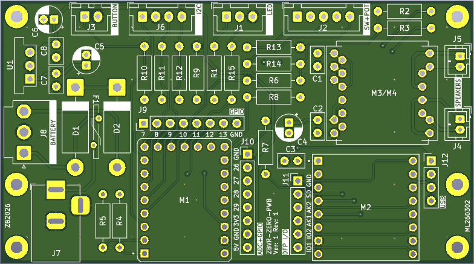
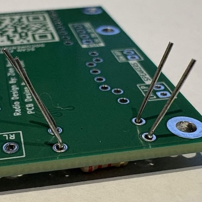
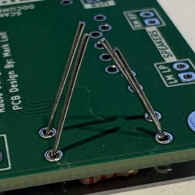

# PCB Assembly Guide

![alt text][begin]

So you've bought the PCB, and a pile of parts, now what? Now the fun begins! 

This guide is intended for beginners, but is not a tutorial on how to solder. There are plenty of good resources out there already for that. Instead this guide will just walk through the process of populating the board. Intermediate and advanced readers will likely want to just go from the [schematics][1]. 

Note that this guide will produce a board that is populated to be essentially equivalent to what Zion featured in his original videos with the breadboard. There are positions for more components on the board for various build options, mainly support for a battery pack, which will be released in the near future. If you will want to go with the battery option, it will be made as an upgrade path for the current board, so there is no harm in building this configuration first.

[1]: /assets/zbvr-pwb-v1-a-sch.pdf
[begin]: ./assets/pcb-blanks.jpg "blank radio PCB boards"

---

## Materials
### PCB Only Bill Of Materials
All items below (except the RP2040-Zero) can be purchased via this [list at DigiKey][2] The list includes additional items not listed here, but are used later in the radio assembly.

#### Soldered Components

- 2x 100 ohm resistor
- 4x 1K resistor
- 3x 2K resistor
- 1x 4K7 resistor
- 2x 10K resistor
- 1x 10nF capacitor (`103` / 10000pF)
- 2x 100nF capacitor (`104` / 0.1uF)
- 1x 10uF Capacitor
- 2x JST PH series 2 pin connector (`B2B-PH-K-S`)
- 1x JST XH series 2 pin connector (`B2B-XH-A`)
- 1x JST XH series 3 pin connector (`B3B-XH-A`)
- 1x JST XH series 5 pin connector (`B5B-XH-A`)
- 1x 1x4 pin female header (`PPTC041LFBN-RC`) *
- 1x 1x5 pin female header (`PPTC051LFBN-RC`)
- 1x 1x6 pin female header (`PPTC061LFBN-RC`) *
- 2x 1x8 pin female header (`PPTC081LFBN-RC`)
- 2x 1x9 pin female header (`PPTC091LFBN-RC`)

***Note:*** Items Marked with the `*` are intended for the `DFR0119-O` amplifier module in my DigiKey Bill of Materials. If you are using the generic `PAM8403` based amplifier from Amazon (or other source) that is in the original Zion Brock Bill of Materials, replace the two marked items with the following:
-  3x 1x2 pin female header (PPTC021LFBN-RC)
-  1x 1x3 pin female header (PPTC031LFBN-RC)

#### Plugged in Modules

- 1x `RP2040-Zero` microcontroller module
- 1x `DFR0299` DFRobot DFPlayer-Mini module
- 1x `DFR0119-O` DFRobot PAM8403 amplifier module 

### Required Materials

- Solder	

### Optional Materials

- solder wick / Desoldering braid

## Tools
### Required Tools

- Soldering Iron
- Wire Cutters

### Optional Tools

- 3D printed lead bending jig [files & instructions](#bender)
- 3D printed PCB holder [files & instructions](#holder)
- Solder Sucker
- Tweezers
- Digital Volt Meter

[2]: https://www.digikey.com/en/mylists/list/7UZQIHX73I

---

## Assembly

### Module Headers

Before we begin on the PCB itself, now is a great time to take advantage of the blank PCB to act as a jig to help align the headers that need to be soldered on the modules. So if any of your modules (RP-Zero, DFPlayer, or amplifier) came without the header pins pre-soldered, now is the time to do it.

1. Start by installing the blank PCB, component side up, into the 3D printed PCB holder -- without the spring-plate installed.  ![alt text][mod1]
2. If you have a single long header strip, you need to cut it into the required lengths at the notches. You can use your wire cutters for this.  ![alt text][hdr1]![alt text][hdr2]
3. Drop the header pins into the corresponding holes on the PCB, long side down.  ![alt text][mod2]
4. Place the module over the pins  ![alt text][mod3]
5. Solder the pins.  ![alt text][mod4]

Do this for all your modules that need to have pins soldered. Having the pins-pre-soldered on the modules will come in handy later.

Set the modules aside for now.

[mod1]: ./assets/mod1.jpg "Blank PCB in holder"
[mod2]: ./assets/mod2.jpg "Blank PCB in holder with header pins installed"
[mod3]: ./assets/mod3.jpg "Blank PCB in holder with header pins and module in place"
[mod4]: ./assets/mod4.jpg "Blank PCB in holder with header pins soldered on module"
[hdr1]: ./assets/hdr1.jpg "uncut header row"
[hdr2]: ./assets/hdr2.jpg "header cut into various lengths"

---

### PCB Soldering

The general process for soldering the PCB will consist of moving from the shortest height components to the tallest. As such, for the components we have, our order will be.

- Resistors
- Small Capacitors
- Speaker Connectors
- Front Panel Connectors (Pot, LED, Button)
- Module Headers
- Large Capacitors

If using the soldering jig, you will want the spring loaded plate to be installed for the remainder of the steps.

When installing components with long leads (resistors and capacitors), you can bend the leads slightly out (away from the centre of the part) or in (towards the centre of the part). This will help prevent the part from falling out when you flip the board over.

 

#### Resistors

While we don't have a huge number of resistors, they are all contained in a pretty close area, as such we'll solder the resistors in 2 phases to keep from having too many long leads getting in our way. You may want to use the bending jig to bend the resistor leads before inserting into the board. If you bulk pre-bend them, just be sure to keep track of which is which. Also note that resistors do not have a defined polarity, so the orientation of them in the PCB does not matter.

##### Vertical Group
To keep things easy, we'll group the resistors by overall orientation, we'll tackle the vertical ones first.

1. 1K: R1, R4, R5, R7  ![alt text][ResV-1K]
2. 4K7: R10  ![alt text][ResV-4K7]
3. 10K: R9  ![alt text][ResV-10K]

At this point your board should look something like this

![alt text][ResV-1]
![alt text][ResV-2]

Put the board in the holder

![alt text][ResV-3]

Solder

![alt text][ResV-4]

Clip off excess lead

![alt text][ResV-5]

[ResV-1K]: ./assets/assembly-renderings/01-ResV-1K.png "PCB Rendering, showing locations for 1K resistors"
[ResV-4K7]: ./assets/assembly-renderings/02-ResV-4K7.png "PCB Rendering, showing location for 4K7 resistor"
[ResV-10K]: ./assets/assembly-renderings/03-ResV-10K.png "PCB Rendering, showing location for 10K resistor"

[ResV-1]: ./assets/01-ResV-1.jpg "Current Component Side View"
[ResV-2]: ./assets/01-ResV-2.jpg "Current Solder Side View"
[ResV-3]: ./assets/01-ResV-3.jpg "Board in PCB Holder, unsoldered"
[ResV-4]: ./assets/01-ResV-4.jpg "Board in PCB Holder, soldered"
[ResV-5]: ./assets/01-ResV-5.jpg "Board in PCB Holder, clipped"

##### Horizontal Group

Now we're going to repeat the process for the horizontally aligned resistors

1. 2K: R2, R3, R6  ![alt text][ResH-2K]
2. 10K: R8  ![alt text][ResH-10K]
3. 100R: R13, R14  ![alt text][ResH-100R]

At this point your board should look something like this

![alt text][ResH-1]

Put the board in the holder, solder, and clip

![alt text][ResH-2]

Your board should now look something like this

![alt text][ResH-3]

[ResH-2K]: ./assets/assembly-renderings/04-ResH-2K.png "PCB Rendering, showing locations for 2K resistors"
[ResH-10K]: ./assets/assembly-renderings/05-ResH-10K.png "PCB Rendering, showing location for 10K resistor"
[ResH-100R]: ./assets/assembly-renderings/06-ResH-100R.png "PCB Rendering, showing locations for 100R resistors"

[ResH-1]: ./assets/02-ResH-1.jpg "Current Component Side View"
[ResH-2]: ./assets/02-ResH-2.jpg "Board in PCB Holder, unsoldered"
[ResH-3]: ./assets/02-ResH-3.jpg "Current Component Side View (soldered)"

#### Small Capacitors

Since we only have the 3 total small capacitors we can do them all at the same time. The process here is the same as with resistors. Note that like resistors, these small ceramic capacitors do not have a specific polarity, and can be soldered in either orientation.

1. 10nF/103: C1 (10,000pF)  ![alt text][Cap-103]
2. 100nF/104: C2, C3 (0.1uF)  ![alt text][Cap-104]

At this point your board should look something like this

![alt text][SmCap-1]

Put the board in the holder, solder, and clip

![alt text][SmCap-2]

[Cap-103]: ./assets/assembly-renderings/07-Cap-103.png "PCB Rendering, showing location for 10nF capacitor"
[Cap-104]: ./assets/assembly-renderings/08-Cap-104.png "PCB Rendering, showing locations for 100nF capacitors"

[SmCap-1]: ./assets/03-SmCap-1.jpg "Current Component Side View"
[SmCap-2]: ./assets/03-SmCap-2.jpg "Board in PCB Holder, unsoldered"

#### Speaker Connectors

The next step up in component height are the speaker connectors. In this case the connectors are self gripping, so we don't need the jig. Just press the connectors in, flip the board over, and solder the pins. We also don't need to clip the pins for these, or any of the connectors going forward. Please note the connector orientation in the photo below before soldering.

1. JST-PH2: J4, J5  ![alt text][Con-PH2]

At this point your board should look something like this

![alt text][Con-PH]

[Con-PH2]: ./assets/assembly-renderings/09-Con-PH2.png "PCB Rendering, showing locations for the PH2 connectors"

[Con-PH]: ./assets/04-Con-PH.jpg "Current Component Side View with PH connectors"

#### Front Panel Connectors

The next step up in component height are the front panel control connectors. In this case the connectors are not self gripping. Please note the connector orientation in the photo below before soldering.

1. JST-XH2: J3  ![alt text][Con-XH2]
2. JST-XH3: J1  ![alt text][Con-XH3]
3. JST-XH5: J2  ![alt text][Con-XH5]

At this point your board should look something like this

![alt text][Con-XH-1]

Now things get a little trickier. As the connectors are loose it can be difficult to flip the board over and put it in the jig. Another problem is due to the fact all the connectors are on one side, the jig won't put a flat/even force on them. Instead it tends to push them to the side. To sole this you can use the lead bending jig as a wedge on the opposite side to balance out the plate before soldering.

![alt text][Con-XH-2]

**Tip:** Alternatively, and probably easier here, is to just solder each connector individually outside the jig, using your finger to hold the connector flat to the board as you solder one of the pins to tack it in place. Once all are tacked in, you can proceed to solder the rest of the pins.

Once complete, your board should now look something like this

![alt text][Con-XH-3]

[Con-XH2]: ./assets/assembly-renderings/10-Con-XH2.png "PCB Rendering, showing location for the XH2 connector"
[Con-XH3]: ./assets/assembly-renderings/11-Con-XH3.png "PCB Rendering, showing location for the XH3 connector"
[Con-XH5]: ./assets/assembly-renderings/12-Con-XH5.png "PCB Rendering, showing location for the XH5 connector"

[Con-XH-1]: ./assets/05-Con-XH-1.jpg "Current Component Side View with XH connectors, unsoldered"
[Con-XH-2]: ./assets/05-Con-XH-2.jpg "Board in holder with XH connectors, and shim"
[Con-XH-3]: ./assets/05-Con-XH-3.jpg "Current Component Side View with XH connectors, soldered"

#### Module Connectors

Next up are the female headers for each of the modules on the board. These can be a bit floppy, as such I recommend installing the modules into the headers temporarily in order to steady and position them while you tack the headers to the board. Now you won't be able to put the board in the jig with the modules installed. Instead, solder a single pin from each of the header strips for each module to lock them in place. Carefully remove the module. Once all the module headers are installed, then put the board back in the jig and proceed to solder the remaining pins.

Note that the individual header strip designators `MxJxx` are not labelled on the PCB, only the modules themselves `Mx`, but it should be pretty obvious where each goes.

##### M1 - RP2040-Zero Connectors

The RP2040-Zero needs 3 connectors. Two 9pin, and one 5 pin.

1. M1 9 pin: M1J1, M1J3   ![alt text][M1-HDR9]
2. M1 5 pin: M1J2  ![alt text][M1-HDR5]

Install the RP2040-Zero module to hold the connectors steady, flip the board and solder one or two pins from each of the 3 header strips to lock them in place. Then carefully remove the RP2040-Zero 

[M1-HDR9]: ./assets/assembly-renderings/13-HDR-1x9.png "PCB Rendering, showing locations for the M1 9-pin headers"
[M1-HDR5]: ./assets/assembly-renderings/14-HDR-1x5.png "PCB Rendering, showing location for the M1 5 pin header"

##### M2 - DFPlayer Connectors

The DFPlayer-mini needs two 8-pin connectors.

1. M2 8 pin: M2J1, M2J2   ![alt text][M2-HDR8]

[M2-HDR8]: ./assets/assembly-renderings/15-HDR-1x8.png "PCB Rendering, showing locations for the M2 8-pin headers"

Install the DFPlayer module to hold the connectors steady, flip the board and solder one or two pins from each of the 2 header strips to lock them in place. Then carefully remove the DFPlayer. 

##### M3/M4 - Amplifier Connectors

At this point we come to a slight fork in the road. The board has been designed to support either the `DFR0119-O` amplifier module from DFRobot/DigiKey, or the generic `PAM8403` amplifier module from Amazon (or other sources). If you plan to use the DFRobot amplifier module from the PCB BOM, Follow the [M3 Amplifier](#M3AMP) instructions. If you plan to use the generic `PAM8403` amplifier module from Amazon, proceed to the [M4 Amplifier](#M4AMP) section.

######    M3 Amplifier

1. M3 6 pin: M3J1   ![alt text][M3-HDR6]
2. M3 4 pin: M3J2   ![alt text][M3-HDR4]

Install the amplifier module to hold the connectors steady, flip the board and solder one or two pins from each of the 2 header strips to lock them in place. Then carefully remove the amplifier. 

[Continue](#AMPWRAP) below.

[M3-HDR6]: ./assets/assembly-renderings/16-HDR-1x6.png "PCB Rendering, showing location for the M3 6-pin header"
[M3-HDR4]: ./assets/assembly-renderings/17-HDR-1x4.png "PCB Rendering, showing location for the M3 4-pin header"

######    M4 Amplifier

1. M4 3 pin: M4J1   ![alt text][M4-HDR3]
2. M4 2 pin: M4J2, M4J3, M4J4   ![alt text][M4-HDR2]

Install the amplifier module to hold the connectors steady, flip the board and solder one or two pins from each of the 4 header strips to lock them in place. Then carefully remove the amplifier. 

[Continue](#AMPWRAP) below.

[M4-HDR3]: ./assets/assembly-renderings/18-HDR-1x3.png "PCB Rendering, showing location for the M4 3-pin header"
[M4-HDR2]: ./assets/assembly-renderings/19-HDR-1x2.png "PCB Rendering, showing locations for the M4 2-pin headers"

---
 ***Common To Both Amplifier Modules***

Once all the module headers are tacked in, and the modules removed again, the board can be placed into the jig and the remainder of the pins soldered.

#### Electrolytic Capacitor

Our final, and tallest component is the 10uF electrolytic capacitor. Unlike the capacitors, and resistors, we did before. This capacitor has a defined orientation and must be installed in the correct orientation. The soldering process remains the same as the resistors, except we can't use the jig here. 

1. 10uF: C4  ![alt text][Cap-10u]

Note the white marking on the PCB on the one side of the circle

![alt text][Cap-1]

This the white stripe with the `-` on the side of the capacitor must align with the white marking on the board.

![alt text][Cap-2]

Once the cap is soldered, and clipped, your board should look something like this

![alt text][Cap-3]

[Cap-10u]: ./assets/assembly-renderings/20-Cap-10u.png "PCB Rendering, showing location for the 10uF capacitor"

[Cap-1]: ./assets/07-Cap-1.jpg "Close up showing silkscreen marking for the capacitor, unsoldered"
[Cap-2]: ./assets/07-Cap-2.jpg "close up showing the markings on  the capacitor"
[Cap-3]: ./assets/07-Cap-3.jpg "image of board with capacitor, soldered"

---

#### FIN!
Congratulations on making it this far, you now have a fully populated PCB for the Vintage Radio. At this point, before powering the board, you should visually inspect all your soldered joints to make sure you didn't miss any, or that there are no shorts between pins. If you must touch up, you can use the soldering jig, without the spring-plate, to cradle the board (without modules) for you. If you have a meter, you can test for shorts between adjacent pins and continuity between source and destination points (you'll need to read the schematic to determine the from-to points to measure). 

All that's left to do for the PCB now is install the modules, and program the micro. Be sure to check the [Wiring Harness Assembly Guide](./Wiring%20Harness%20Assembly%20Guide.md) to complete the wiring for the radio.

![alt text][fin]

[fin]: ./assets/final-assy.jpg "assembled radio board"
---

##  Lead Bending Tool

![alt text][bendaid]

The Bending aid is designed to allow for accurately bending the leads of 1/4W resistors for a standard 0.4in hole spacing. The jig thickness is also such that if the leads are cut flush with the bottom, it should be just about perfect for a standard 1.6mm (0.064in) PCB. Though I would recommend trimming after soldering.

The bending jig is on the plate in the `.3MF` print profile for [assembly-jigs][3]
or the `STL` can be [downloaded directly](./assets/soldering-aids/bend-aid-new.stl).

**Note:** that these are the same models as are on the radio project page over on [MakerWorld][4]. 

![alt text][bend1]
![alt text][bend2]

[bendaid]: ./assets/bend-aid.jpg "component lead bending jig"
[bend1]: ./assets/bend1.jpg "resistor in bending jig"
[bend2]: ./assets/bend2.jpg "resistor in bending jig, with bent leads"
---

##  PCB Holder

![alt text][pcbaid]

The PCB holding jig is intended to work like a 3rd hand, helping to support components as you are soldering. 

All the parts for the PCB holder jig are on the plate in the `.3MF` print profile for [assembly-jigs][3]
or the individual  `STL` files can be downloaded:

- [main holder](./assets/soldering-aids/soldering-aid.stl) qty: 1
- [clip](./assets/soldering-aids/soldering-aid-clip.stl) qty: 2
- [plate] (./assets/soldering-aids/soldering-aid-plate.stl) qty: 1
- [spring](./assets/soldering-aids/soldering-aid-spring.stl) qty: 2

**Note:** that these are the same models as are on the radio project page over on [MakerWorld][4]. 

The clips simply slide into their respective grooves on the main holder body. (Photos are of an earlier prototype that was asymmetrical, the download is completely symmetrical in its design)

![alt text][pcbaid1]

To assemble the plate, the 2 springs need to be glued to the plate in the provided divots. You may need to file off any elephants foot, and the corners of the nub on the spring for it to sit firm and flat in the plate feature. Simply put a drop of CA glue in the divot and then press in the nub of the spring. (Photos are of an earlier prototype that was asymmetrical, the download is completely symmetrical in its design)

![alt text][pcbaid2]
![alt text][pcbaid3]

[pcbaid]: ./assets/pcb-aid.jpg "PCB aid with plate"
[pcbaid1]: ./assets/holder.jpg "PCB aid with clips in place"
[pcbaid2]: ./assets/blankplate.jpg "PCB aid plate, no springs installed"
[pcbaid3]: ./assets/plate.jpg "PCB aid plate with springs in place"

[3]: ./assets/assembly-jigs.3mf
[4]: https://makerworld.com/en/models/2163838-my-vintage-radio-offline-am-style-music-player
